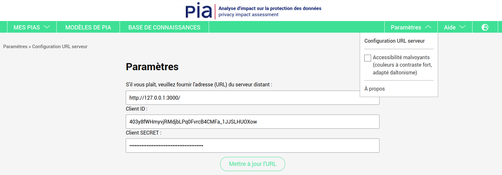
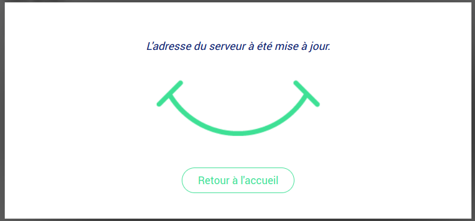

Getting started
=
Here is **Docker-Compose** configuration for developpement purpose. Everything is automated from creating containers to setting up the database. A simple `docker-compose up` does everything and gives a running website : front-end, back-end and database.
However, you still have to add the back-end URL on the front-end interface as we don't see a way to automate it (it's explained below).
We include the Dockerfiles so you can build the images yourself. The `docker-compose.yml` is here for demonstration purpose. You may want to use Docker with Kubernetes for example for production.

Prerequisites
-
1. Get and install **Docker** https://www.docker.com/get-docker on your machine
2. `git clone` this project or download` pia-docker.zip` and unzip it.

To build a specific branch and name the resulting docker images
-
1. Change `ARG PIA_BRANCH=sso` replacing sso by the name of the branch you want to build from here [front branches](https://github.com/LINCnil/pia-back/branches/all)
2. Change `ARG PIA_BRANCH=sso` replacing sso by the name of the branch you want to build from here [front branches](https://github.com/LINCnil/pia/branches/all)
3. Build with `IMAGE_TAG=sso docker compose -f docker-compose-with-build.yml up --build --force-recreate`

To build a specific tag and name the resulting docker images
-
1. Uncomment `#TAG RUN wget https://github.com/LINCnil/pia-back/archive/refs/tags/$PIA_VERSION.zip \` in cnil-pia-back/Dockerfile
2. Commment `RUN wget https://github.com/LINCnil/pia-back/archive/$PIA_BRANCH.zip \` in cnil-pia-back/Dockerfile
3. Change `ARG PIA_VERSION=v4.1.0` for using a specific tagged version from here [back tags](https://github.com/LINCnil/pia-back/tags) prefixed with v
4. Uncomment `#TAG RUN wget https://github.com/LINCnil/pia/archive/refs/tags/$PIA_VERSION.zip \` in cnil-pia-back/Dockerfile
5. Commment `RUN wget https://github.com/LINCnil/pia/archive/$PIA_BRANCH.zip \` in cnil-pia-front/Dockerfile
6. Change `ARG PIA_VERSION=v4.1.0` for using a specific tagged version from here [front tags](https://github.com/LINCnil/pia/tags) prefixed with v
7. Build with `IMAGE_TAG=4.1.0 docker compose -f docker-compose-with-build.yml up --build --force-recreate`

Run the full app through Docker-Compose for production
-
1. Fill the environment variables in `docker-compose.yml`
2. Open a shell and switch to the `pia-docker` directory
3. Run the containers by typing `docker-compose up` into the shell
4. Access the website with `localhost:8080` or `yourdomain.net:8080`

Addtional information
-
The installation under Windows 10 is described in the Wiki:
https://github.com/kosmas58/pia-docker/wiki/Installation-under-Windows-10

Connect the frontend (or client app) to the backend
-

To get the values from the backend :
- Run `docker ps | grep "cnil-pia-back"` to get the CONTAINER_ID of your back container .
- Run `docker exec -it CONTAINER_ID /bin/bash` (replacing CONTAINER_ID with first column from command above)
- Run `rails c`
- To get the Client ID run `Doorkeeper::Application.create(name: "PIA", redirect_uri: "urn:ietf:wg:oauth:2.0:oob", scopes: ["read", "write"])`
- To get the Client SECRET run `Doorkeeper::Application.select(:uid, :secret).last.uid and Doorkeeper::Application.select(:uid, :secret).last.secret`
- Open PIA front end in your browser. In this development setup it should be at `http://127.0.0.1:8080/`
- Go to menu "Tools" > "Settings" ( Paramètres > Configuration URL serveur in French in the screenshot below)
- Fill in Host (should be http://127.0.0.1:3000), Client ID and Client SECRET field.
- Click button "Update" to save settings
- If you get a green smile, then your front is connected to the backend and should be able to "login" and your document will be saved in the database.

Green smile
